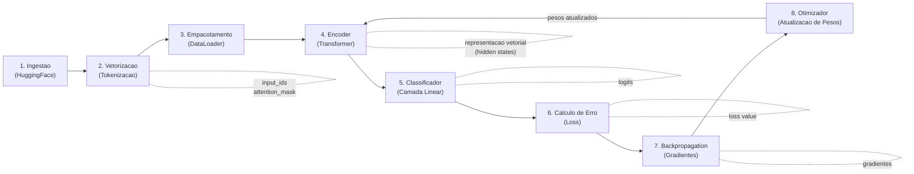

# Hate-Speech Detector

Detector de discurso de ódio baseado em **Transformers** (PyTorch + Hugging Face).

Este repositório implementa um pipeline completo de fine-tuning de um modelo de linguagem pré-treinado para classificação binária de texto.

## Objetivo da Entrega Parcial

Construir e validar a **infraestrutura de aprendizado de máquina** — uma prova de conceito onde um texto consegue entrar no sistema, ser transformado em números, passar pelas camadas do Transformer, gerar um erro (loss) e fazer esse erro voltar para atualizar os pesos da rede.

## Pipeline




1. **Ingestão via Nuvem** — Carrega o dataset do Hugging Face e divide em treino/validação.
2. **Vetorização** — O tokenizador converte texto cru em `input_ids` e `attention_mask`.
3. **Empacotamento** — Os dados vetorizados são agrupados em lotes via `DataLoader`.
4. **Encoder (Transformer)** — As camadas de atenção do modelo pré-treinado processam os tokens e produzem representações vetoriais ricas (hidden states).
5. **Classificador (Camada Linear)** — Uma camada fully connected recebe a representação do encoder e projeta para `num_labels` logits (um score por classe).
6. **Cálculo de Erro** — Logits são comparados com os rótulos reais para produzir a loss.
7. **Backpropagation** — O erro é propagado de volta pela rede, calculando os gradientes de cada peso.
8. **Otimizador** — Usa os gradientes para atualizar os pesos do encoder e do classificador, reduzindo o erro na próxima iteração.

## Estrutura do Projeto

```
Hate-Speech-Detector/
├── src/
│   ├── __init__.py        # Torna src/ um pacote Python
│   ├── dataset.py         # Módulo de Dados: conexão HuggingFace, tokenização, DataLoaders
│   ├── model.py           # Módulo de Arquitetura: instancia o Transformer pré-treinado
│   └── engine.py          # Módulo de Treinamento: lógica de treino, validação e checkpoints
├── main.py                # Orquestrador: importa os módulos e executa o pipeline
├── requirements.txt       # Dependências e versões
├── .gitignore             # Arquivos ignorados pelo Git
└── README.md              # Documentação (este arquivo)
```

## Pré-requisitos

- **Python** 3.10 ou superior
- **GPU** (opcional) — o pipeline detecta automaticamente CUDA e usa CPU como fallback

## Instalação

```bash
# 1. Clone o repositório
git clone https://github.com/Davi-SB/Hate-Speech-Detector.git
cd Hate-Speech-Detector

# 2. Crie um ambiente virtual
python -m venv .venv

# 3. Ative o ambiente virtual
# Windows
.venv\Scripts\activate
# Linux / macOS
source .venv/bin/activate

# 4. Instale as dependências
pip install -r requirements.txt
```

## Como Executar

```bash
python main.py
```

O script irá:

1. Detectar o device disponível (CPU ou GPU).
2. Carregar o modelo Transformer pré-treinado e o tokenizador.
3. Criar os DataLoaders de treino e validação.
4. Executar o loop de treinamento (3 epochs por padrão).
5. Salvar o modelo treinado em `checkpoints/`.

### Hiperparâmetros

Os hiperparâmetros são definidos como constantes no topo de `main.py`:


| Parâmetro        | Valor padrão | Descrição                      |
| ---------------- | ------------ | ------------------------------ |
| `BATCH_SIZE`     | 16           | Amostras por lote              |
| `LEARNING_RATE`  | 2e-5         | Taxa de aprendizado do AdamW   |
| `NUM_EPOCHS`     | 3            | Quantidade de epochs de treino |
| `NUM_LABELS`     | 2            | Classes de classificação       |
| `CHECKPOINT_DIR` | checkpoints/ | Diretório para salvar o modelo |


## Equipe e Divisão de Tarefas


| Integrante | Responsabilidade                            | Arquivo(s)                                 |
| ---------- | ------------------------------------------- | ------------------------------------------ |
| A          | Infraestrutura, orquestração e documentação | `main.py`, `README.md`, `requirements.txt` |
| B          | Engenharia de dados via nuvem               | `src/dataset.py`                           |
| C          | Arquitetura do modelo                       | `src/model.py`                             |
| D          | Engenharia do treinamento                   | `src/engine.py`                            |
| E          | Validação e checkpoints                     | `src/engine.py`                            |


